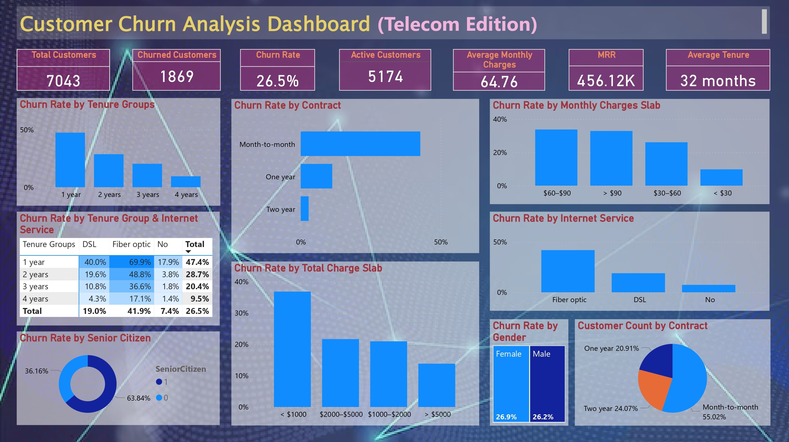

# 📊 Customer Churn Analysis Dashboard (Telecom Edition)

An interactive **Power BI dashboard** analyzing customer churn in the telecom industry using the **Telco Customer Churn** dataset.  
This project identifies key churn drivers, customer segments at risk, and actionable insights to improve retention.

---

## 📸 Dashboard Preview

---

## 🎯 Project Objective

The goal of this project is to analyze customer churn behavior and understand:

- **Why customers are churning**
- **Which segments have the highest churn**
- **Business patterns that influence customer retention**
- **Key KPIs that help track churn performance**

---

## 🧠 Key Business Insights

- **Month-to-month contract** customers churn **3× more** than long-term contract holders.
- Customers with **tenure < 12 months** have the **highest churn risk**.
- **Fiber Optic** customers churn at a significantly higher rate than **DSL** users.
- Higher **monthly charges** strongly correlate with increased churn.
- Customers with **low total charges** (new customers) churn more frequently.

These insights can guide strategic actions such as targeted retention offers, pricing adjustments, and personalized customer engagement.

---

## 🗂 Dataset Information

- Source: Telco Customer Churn (Kaggle)
- Rows: ~7,000
- Columns: 21
- Contains customer demographics, services, billing information, and churn status.

---

## 🧹 Data Cleaning & Preparation

Performed using Power Query:

- Handled missing values in **TotalCharges**
- Converted **tenure** into custom **tenure groups**
- Created **ChurnFlag** (Yes = 1, No = 0)
- Created **MonthlyChargeSlab** and **TotalChargeSlab**
- Removed duplicates and corrected data types

---

## 🧮 DAX Measures Used

 - ChurnCount = CALCULATE(COUNTROWS('Table'), 'Table'[Churn] = "Yes")
 - ChurnRate = DIVIDE([ChurnCount], [TotalCustomers], 0)
 - TotalCustomers = COUNTROWS('Table')
 - AvgTenure = AVERAGE('Table'[tenure])
 - AvgTenureDisplay = FORMAT([AvgTenure], "0") & " months"

## 📊 Visuals Included in Dashboard

 - KPI Cards (Total Customers, Churn Rate, Avg Tenure, etc.)
 - Churn by Contract Type (Most important driver)
 - Churn by Tenure Group
 - Churn by Internet Service
 - Churn by Monthly Charge Slab
 - Heatmap: Tenure Group × Internet Service
 - Customer Distribution by Contract Type

Additional charts explaining churn behavior on other factors

## 🛠 Tools & Technologies

 - Power BI Desktop
 - DAX
 - Power Query
 - Data Modeling
 - Telco Customer Churn Dataset

## 📌 Conclusion

The churn analysis highlights a few strong patterns:
 - Month-to-month contracts have the highest churn. Long-term contracts reduce churn significantly.
 - Fiber optic users churn more than DSL users, likely due to pricing or service satisfaction.
 - High monthly charges correlate strongly with churn.
 - New customers (low tenure) are most likely to leave early.
 - Lack of tech support/security add-ons is linked with higher churn.
 - Senior citizens show slightly higher churn.
 - Customers using electronic check payments churn more than those using auto-payments.
Overall, churn is driven by contract type, pricing, service experience, and support availability. Strengthening early engagement and offering value-added services can help reduce churn.

## 📥 How to Use This Project

Download or clone this repository

Open Telco Customer Analytics_dashboard.pbix using Power BI Desktop

Explore dashboard pages, slicers, and visuals

Experiment with filters to analyze different customer segments

## 👩‍💻 Author

Diya Philip

Aspiring Data Analyst skilled in Power BI, SQL, and Excel.
